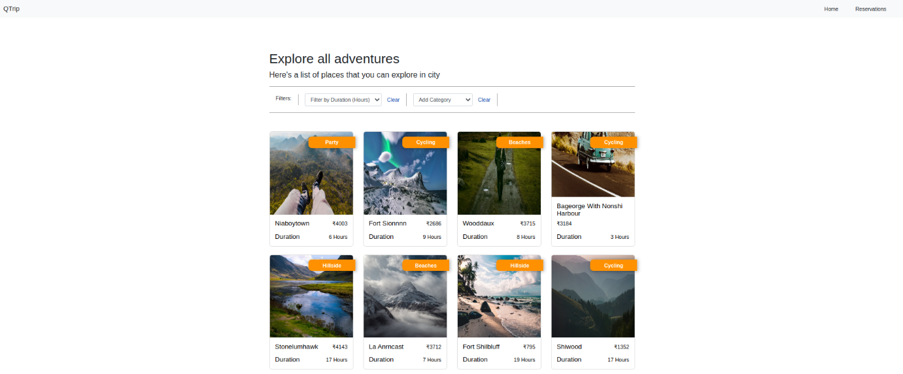
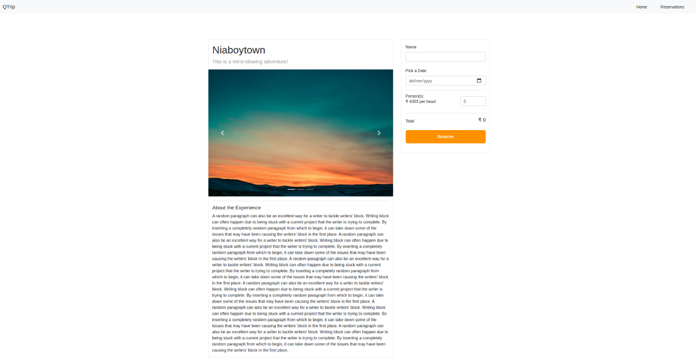
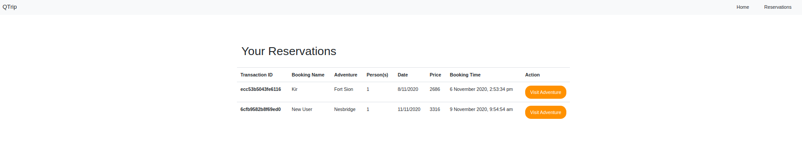
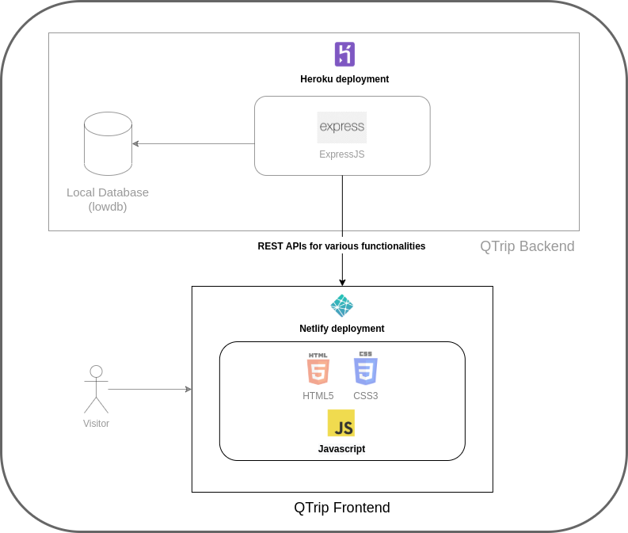
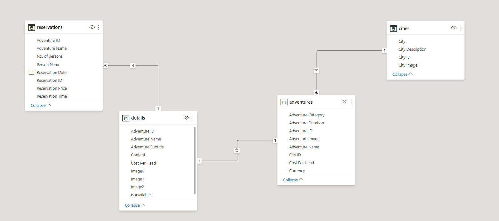

# Travel-Bingo

Do leave a star :star: if you like this repo :blush:   

  

## Basic features of application
* Allows the user to view different cities
* Allows them to select the city
* Allows them to view the adventures in the city
* Filter the adventures based on time range and activities
* View the entire details of the selected adventure and city 
* Check whether it is available or not for booking
* If available book a slot by filling total no. of heads and date of visit
* Finally, view the booked adventure details in the reservation page.

## Components
The Travel-Bingo website will have these 4 pages:

* Landing Page - This is the starting page for the website. It lists the various cities for which you can explore adventures
 
    

* Adventures Page - This is the page that you’ll get to by clicking on one of the city cards on the Landing Page. It lists the Adventures available for that city.

 
•	Adventure Details Page - This is the page that you’ll get to by clicking on one of the Adventures on the Adventures Page. It lists details about that particular Adventure.

•	Reservations Page - Once the users make reservations on the Adventure Details Pages, the Reservations Page can be used to view all the reservations.

## Background
In this project, I used JavaScript to build on top of the provided HTML and CSS files for QTrip.
I implemented dynamic functionality such as fetching Cities, Adventures, Adventure Details and Reservations from a backend server. The JavaScript code will fetch this information and manipulate the DOM of the HTML page to make the site interactive.

### Data Model

 

## Tech Stack Used
### Frontend:
    * HTML
    * CSS
    * Vanilla JavaScript
### Backend:
    * NodeJS
    * Express
### Database:
    * MongoDB

